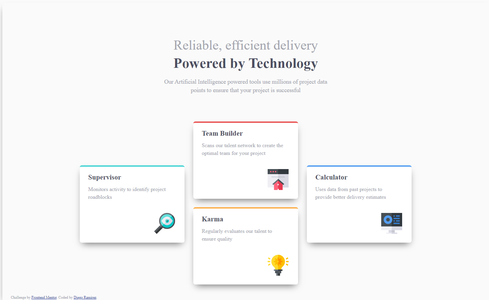
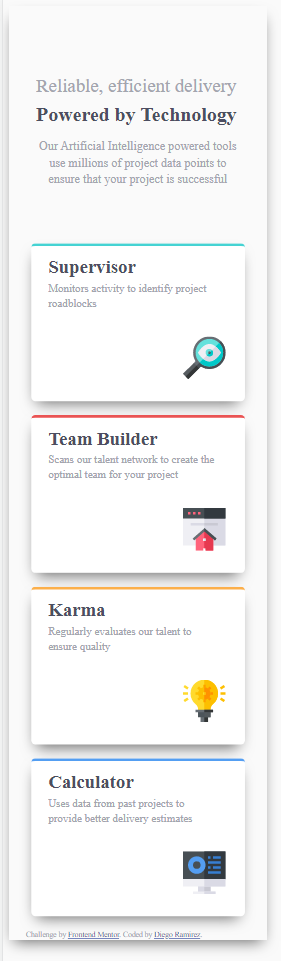

# Frontend Mentor - Four card feature section solution

This is a solution to the [Four card feature section challenge on Frontend Mentor](https://www.frontendmentor.io/challenges/four-card-feature-section-weK1eFYK). Frontend Mentor challenges help you improve your coding skills by building realistic projects. 

### The challenge

Users should be able to:

- View the optimal layout for the site depending on their device's screen size

### Screenshot

### Links

- Solution URL: [Add solution URL here](https://www.frontendmentor.io/solutions/fourcardfeaturesectionmaster-project-rziEmZUu3)
- Live Site URL: [Add live site URL here](https://four-card-feature-section-master-nine-phi.vercel.app/)

### Author

- Website - [Github](https://www.github/daarfarias)
- Frontend Mentor - [@daarfarias](https://www.frontendmentor.io/profile/daarfarias)

